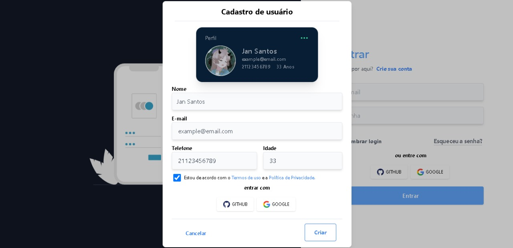

# Login and registration page made with Vue + Tailwind

Neste formulário foi utilizado:

Tailwind 2
Vue 3 
Node 16.15

<p align="center">
   
   
</p>

## Project setup
```
npm install
```

### Compiles and hot-reloads for development
```
npm run serve
```

### Compiles and minifies for production
```
npm run build
```

### Customize configuration
See [Configuration Reference](https://cli.vuejs.org/config/).
